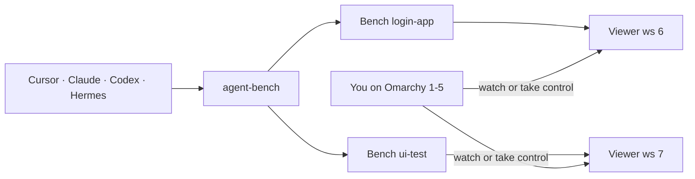

# omarchy-agent-bench

**Give AI agents their own nested X11 desktop on [Omarchy](https://omarchy.org) / Hyprland. You keep workspaces 1–5.**

[Português](README.pt-BR.md) · [Why](docs/why.md) · [Install](docs/install.md) · [Coexistence](docs/coexistence.md) · [CDP and CUA](docs/cdp-and-cua.md) · [Architecture](docs/architecture.md)

Coding agents on a personal Linux desktop keep stealing the mouse, opening tabs in the human Chromium, and firing `hyprctl dispatch workspace`. This project is the other way: each concurrent task gets a **named bench** — its own Xvnc display, Openbox, Chromium profile, D-Bus, clipboard, and CDP endpoint. A TigerVNC viewer sits on a **reserved agent workspace (6–11)** so you can watch without the agent warping your pointer.

It is isolation of **display and input**, not a security sandbox. The agent still sees your files.

## What you get

| Piece | Role |
| --- | --- |
| `agent-bench` | CLI: `ensure`, `cdp`, `browser`, `exec`, `keep`, `gc`, … |
| `agent-bench-mcp` | One stdio MCP for every harness: `bench_ensure`, `bench_cdp`, CUA with `bench=` |
| Workspaces **6–11** | Persistent Hyprland workspaces for viewers. Never 12+ (that workspace is born on the focused monitor) |
| Workspaces **1–5** | Human session. Read-only `hyprctl -j` is fine. No grim, ydotool, or computer-use there |
| Skills | Drop-in Agent Skills: coexistence, bench operations, persistent-login recipe |

An empty Xvnc is cheap (~80–140 MiB, ~0.3 s). The cost is Chromium. Benches start on demand. Idle ones with no real pages are reaped after 3 hours (`padrao` and human-control stay). Chromium profiles survive `stop`; `agent-bench keep NAME` writes `.keep` so disk GC leaves logins alone.



## Try it

Needs an Omarchy or Hyprland user session, Python 3, systemd --user, TigerVNC (`Xvnc` + `vncviewer`), Openbox, Chromium, xdotool, xclip, xterm.

```sh
git clone https://github.com/LucasOl1337/omarchy-agent-bench.git
cd omarchy-agent-bench
./install.sh
```

The installer copies into `~/.local/share/omarchy-agent-bench`, links `~/.local/bin/agent-bench`, enables `agent-bench-views.service`, and appends `require("hypr.agent-bench")` to `~/.config/hypr/hyprland.lua` (with a timestamped backup). It does **not** restart benches that are already running.

```sh
agent-bench ensure demo
agent-bench browser-status demo
agent-bench cdp demo
agent-bench browser demo https://example.com
agent-bench screenshot demo /tmp/demo.png
agent-bench list
```

Browser commands require an already prepared `desktop/sessions/demo/chromium/Default` for that bench. They validate the PID and cgroup before exposing CDP; they do not copy cookies, create an empty profile, or fall back to the human Chromium.

Visit the bench with **Super+6** … **Super+9**, **Super+0** (workspace 10), or **Agent benches** in the launcher. Super+6 is view-only: the agent keeps working. **Super+Alt+A** (or **Take control**) lets you click and type. **Super+1** on that monitor gives the bench back. Clipboard stays separate in both modes.

Point the harness at the multiplexed MCP (examples in [`contrib/mcp/`](contrib/mcp/)):

```json
{
  "mcpServers": {
    "agent-bench": { "command": "agent-bench-mcp" }
  }
}
```

Then `bench_ensure` with `{ "bench": "demo" }`, `bench_cdp` for Playwright `connectOverCDP`, and CUA tools with `bench: "demo"`. Do not attach computer-use to the human compositor.

## For agents

Copy [`skills/`](skills/) into the skill hub your harness already loads (`~/.agents/skills`, Claude skills, Cursor skills, …). Three skills ship:

1. **`human-agent-coexistence`** — visual work only on benches 6–11
2. **`agent-bench`** — commands, MCP, hygiene, what never to do
3. **`named-login-bench`** — stable names + `.keep` so cookies survive rounds

```sh
agent-bench ensure login-app
agent-bench keep login-app 'recurring login'
# later, same name:
agent-bench cdp login-app
```

Forms: CDP / Playwright on the bench endpoint. Pixel CUA only when the page is opaque. Do not `hyprctl dispatch workspace` — that switches the workspace under the human pointer. Do not `stop` a bench mid-form. Close your own finished tabs.

## What this is not

- Not a VM and not a container. File access is the same as the user.
- Not GPU / Wayland / game validated. The nested screen is 1600×1000 software-rendered X11.
- Not [omarchy-agents](https://github.com/LucasOl1337/omarchy-agents) (that repo is the waybar agent panel). This repo is the nested desktop.

## Development

```sh
cd desktop
python3 -m unittest discover -s . -p 'test_*.py'
```

See [CONTRIBUTING.md](CONTRIBUTING.md). MIT license. Issues and PRs that help other Omarchy users coexist with agents are welcome.
